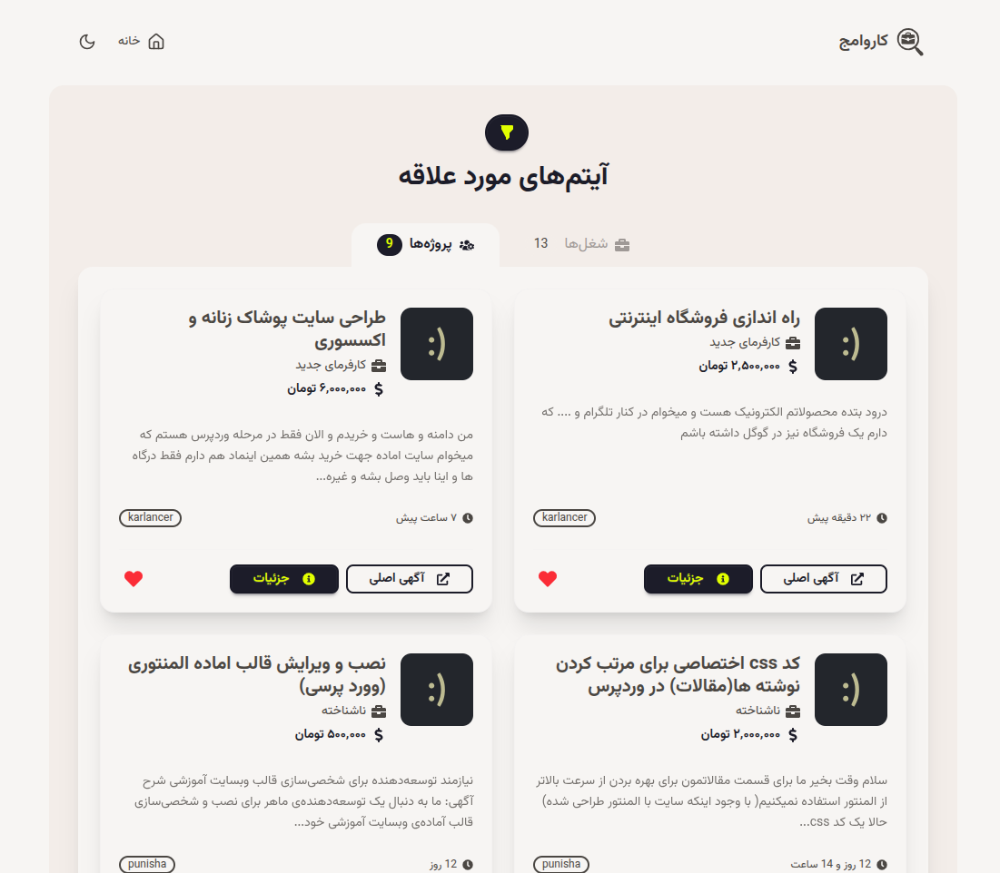
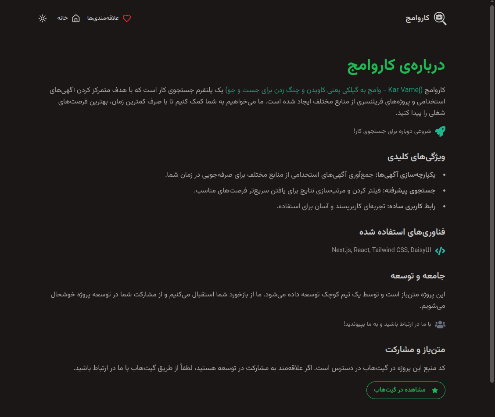

# کاروامج 🚀

جستجوگر آگهی‌های استخدامی و پروژه‌های فریلنسری با تمرکز بر زبان فارسی.

- داکیومنت ساخته شده توسط DeepWiki رو میتونید از طریق این لینک مشاهده کنید و حتی سوال های خودتون رو راجب پروژه ازش بپرسید
  [](https://deepwiki.com/TohidEq/uni-kar-vamej)

## درباره‌ی پروژه 🧐

کاروامج یک پروژه‌ی متن‌باز است که با هدف تسهیل فرآیند جستجوی کار برای فارسی‌زبانان توسعه داده شده است. این پلتفرم با جمع‌آوری آگهی‌های استخدامی و پروژه‌های فریلنسری از منابع مختلف، به شما این امکان را می‌دهد که در کمترین زمان، به فرصت‌های شغلی مورد نظر خود دسترسی پیدا کنید.

هدف ما ایجاد یک تجربه‌ی کاربری ساده، سریع و متمرکز برای جستجوی کار است. ما معتقدیم که دسترسی آسان به اطلاعات شغلی، می‌تواند به افراد در یافتن شغل مناسب و ارتقای مسیر شغلی خود کمک شایانی کند.

### ویژگی‌های کلیدی ✨

- **یکپارچه‌سازی آگهی‌ها:** جمع‌آوری آگهی‌های استخدامی از منابع مختلف (مانند کارلنسر، پونیشا، جابینجا و جاب‌ویژن) در یک مکان واحد.
- **جستجوی پیشرفته:** فیلتر کردن و مرتب‌سازی نتایج جستجو بر اساس فاکتورهای مختلف (مانند دستمزد، موقعیت مکانی و نوع شغل) برای یافتن سریع‌تر فرصت‌های مناسب.
- **ذخیره و مدیریت علاقه‌مندی‌ها:** امکان ذخیره و مدیریت آگهی‌های مورد علاقه برای دسترسی آسان‌تر در آینده.
- **رابط کاربری ساده و روان:** طراحی رابط کاربری با تمرکز بر سهولت استفاده و تجربه‌ی کاربری لذت‌بخش.

## فناوری‌های مورد استفاده 🛠️

- **Next.js:** فریم‌ورک React برای توسعه‌ی سمت کاربر و سمت سرور.
- **React:** کتابخانه‌ی جاوااسکریپت برای ساخت رابط کاربری.
- **Tailwind CSS:** فریم‌ورک CSS برای طراحی و استایل‌دهی سریع.
- **DaisyUI:** کامپوننت‌های UI مبتنی بر Tailwind CSS برای ساخت رابط کاربری.
- **Puppeteer:** برای وب اسکرپینگ وبسایت‌های آگهی.

## راه‌اندازی و اجرا ⚙️

شما می‌توانید کاروامج را به دو روش با استفاده از Docker و بدون Docker اجرا کنید.

### ۱. راه‌اندازی با Docker 🐳

1.  **Docker را نصب کنید:** اگر Docker را نصب ندارید، ابتدا آن را از [وب‌سایت Docker](https://www.docker.com/) دانلود و نصب کنید.
2.  **کد را کلون کنید:**
    ```bash
    git clone github.com/tohideq/uni-kar-vamej
    cd uni-kar-vamej
    ```
3.  **ساخت و اجرا:** دستور زیر را در ترمینال خود اجرا کنید:
    ```bash
    docker-compose up --build
    ```
    این دستور، ایمیج Docker را می‌سازد و اپلیکیشن را اجرا می‌کند.
4.  **دسترسی به اپلیکیشن:** پس از اجرا، می‌توانید با مراجعه به آدرس <http://localhost:3000> از اپلیکیشن استفاده کنید.

### ۲. راه‌اندازی بدون Docker 💻

1.  **Node.js و npm را نصب کنید:** اگر Node.js و npm را نصب ندارید، ابتدا آن‌ها را از [وب‌سایت Node.js](https://nodejs.org/) دانلود و نصب کنید.
2.  **کد را کلون کنید:**
    ```bash
    git clone github.com/tohideq/uni-kar-vamej
    cd uni-kar-vamej
    ```
3.  **نصب وابستگی‌ها:**

    ```bash
    npm install
    ```

    - شاید نیاز باشه `.env.local` بسازید:
    - اول `npx puppeteer browsers install chrome` اجرا کنید و در مسیر روت برنامه فایل `.env.local` را بسازید با این محتوا:

      > - {USER NAME} == natijeye dastoore `whoami`
      >
      > - {VERSION} == دستی برو به اون مسیر ببین اسم پوشه اش چیه؟ همون
      >
      > یعنی بزن:
      >
      > ```bash
      > ls ~/.cache/puppeteer/chrome/
      > ```
      >
      > محتوای فایل `.env.local`:
      >
      > ```bash
      > PUPPETEER_EXECUTABLE_PATH=/home/{USER NAME}/.cache/puppeteer/chrome/linux-{VERSION}/chrome-linux64/chrome
      > PUPPETEER_CACHE_DIR=/home/{USER NAME}/.cache/puppeteer/
      > ```

4.  **اجرا:**

    ```bash
    npm run dev
    ```

    - برای اجرا در سرعت بالا تر و بهینه تر
      > ```bash
      > # این کامند یک مقداری طول میکشه
      > npm run build
      > # اجرای سریع تر و بهینه تر
      > npm run start
      > ```

5.  **دسترسی به اپلیکیشن:** پس از اجرا، می‌توانید با مراجعه به آدرس <http://localhost:3000> از اپلیکیشن استفاده کنید.

## مشارکت 🙏

ما از مشارکت شما در توسعه‌ی کاروامج استقبال می‌کنیم! اگر می‌خواهید به این پروژه کمک کنید، لطفاً از طریق ایجاد یک [Issue](https://github.com/tohideq/uni-kar-vamej/issues) با ما در ارتباط باشید و موارد زیر را در نظر بگیرید:

1.  **Fork کردن مخزن:** مخزن را در حساب گیت‌هاب خود Fork کنید.
2.  **ایجاد Branch:** یک branch جدید برای فیچر یا باگ مورد نظر خود ایجاد کنید (به عنوان مثال: `feature/add-awesome-feature` یا `fix/bug-description`).
3.  **اعمال تغییرات:** تغییرات خود را اعمال کنید.
4.  **Commit کردن تغییرات:** تغییرات خود را Commit کنید.
5.  **Push کردن به گیت‌هاب:** branch خود را به مخزن خود در گیت‌هاب Push کنید.
6.  **ایجاد Pull Request:** یک Pull Request به مخزن اصلی (main) پروژه ارسال کنید.

### نمونه‌هایی برای مشارکت 💡

1.  **بهبود UI/UX:**
    - اضافه کردن انیمیشن‌های جذاب برای دکمه‌ها
    - بهبود ظاهر کلی برنامه
2.  **اضافه کردن قابلیت‌های جدید:**
    - **TODO:** پیاده‌سازی Lazy Load برای کارت‌ها: وقتی کارت به ناحیه دید کاربر رسید، کارت لود شود. (استفاده از `IntersectionObserver`).
    - **TODO:** اضافه کردن امکان به اشتراک گذاشتن آگهی‌ها.
    - **TODO:** اگر کاربر به صفحه جزئیات یک آگهی رفت، وقتی برگشت، داده‌ها ذخیره بمانند و دوباره فچ نشوند.
3.  **بهبود اسکرپینگ اطلاعات:**
    - **TODO:** اگر کلمه کلیدی جستجو شده در گیت‌هاب (داده‌های از قبل فچ شده) نبود، در یک فضای ذخیره‌سازی (مانند Supabase) ذخیره شود.
      - هر IP در ۲۴ ساعت محدودیت ثبت ۲۰ کلمه داشته باشد.
      - کلمه تکراری مجاز به ثبت نباشد.
    - بهبود فرایند اسکرپ اطلاعات از سایت‌های مختلف
    - اضافه کردن سایت‌های بیشتر برای اسکرپ اطلاعات
4.  **افزایش پرفورمنس و سرعت:**
    - **TODO:** افزایش پرفورمنس و سرعت سایت.
    - **TODO:** هندل کردن بهتر Browser و استفاده از کش.
5.  **بهبود مستندات:**
    - ویرایش و بهبود مستندات برای کمک به دیگران.
    - نوشتن تست برای پوشش کد‌ها.
6.  **پیشنهاد تودوهای جدید:**
    - **TODO:** پیشنهاد دادن تودوهای جدید برای بهبود پروژه (با ایجاد یک Issue در گیت‌هاب).

## اسکرین‌شات‌ها 🖼️

<details>
  <summary>صفحه اصلی</summary>
  
</details>

<details>
  <summary>صفحه جستجو</summary>
  
</details>

<details>
  <summary>صفحه علاقه‌مندی‌ها</summary>
  
</details>

<details>
  <summary>صفحه درباره‌ی پروژه</summary>
  
</details>

<details>
  <summary>صفحه اطلاعات بیشتر</summary>
  
</details>

<details>
  <summary>Footer</summary>
  
</details>

<br>

## تم‌ها 🎨

<div dir="ltr" className="grid grid-cols-4 gap-4">

<details>
  <summary>Light Theme</summary>
  
</details>

<details>
  <summary>Dark Theme</summary>
  
</details>

<details>
  <summary>Retro Theme</summary>
  
</details>

<details>
  <summary>Fantasy Theme</summary>
  
</details>

<details>
  <summary>Emerald Theme</summary>
  
</details>

<details>
  <summary>Silk Theme</summary>
  
</details>

<details>
  <summary>Corporate Theme</summary>
  
</details>

<details>
  <summary>Autumn Theme</summary>
  
</details>

<details>
  <summary>Abyss Theme</summary>
  
</details>

<details>
  <summary>Dracula Theme</summary>
  
</details>

<details>
  <summary>Halloween Theme</summary>
  
</details>

</div>

## انتشار 🚀

منتظر انتشار نسخه های بعدی کاروامج باشید.

---

اگر سوالی دارید، لطفاً از طریق ایجاد یک [Issue](https://github.com/tohideq/uni-kar-vamej/issues) با ما در ارتباط باشید.

**با تشکر از حمایت شما!** ❤️
